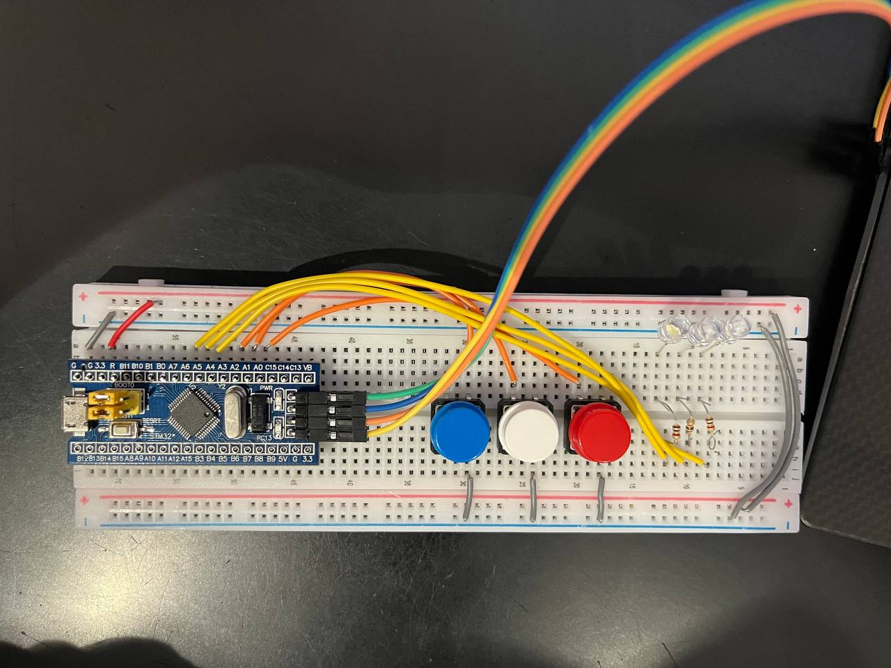

## Passcode mockup for STM32 (Blue Pill) — learning project

### Components
- 1× STM32F103C8 (“Blue Pill”)
- 1× ST-LINK/V2 (programmer/debugger)
- 1× Breadboard
- 3× Momentary push buttons
- 3× LEDs (any colour)
- 3× Resistors ~220–330 Ω (e.g. 330 Ω = orange–orange–brown–gold)
- Jumper wires

### Wiring

